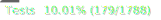
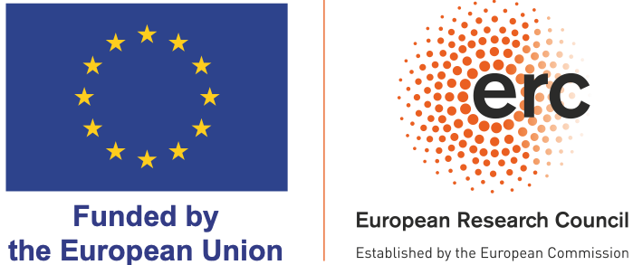

[](https://github.com/LostMa-ERC/lostma-erc.github.io/actions/workflows/deploy.yml)
[](https://github.com/LostMa-ERC/lostma-erc.github.io/actions/workflows/data-ci.yml)
[](docs/coverage.svg)

[](https://creativecommons.org/licenses/by-sa/4.0/)


# Static Site Generator (SSG) Codebase

This is the codebase for the LostMa ERC project's static [website](https://lostma-erc.github.io/).


## Purpose

Our website's codebase is publicly available in order to promote all aspects of open science, including the accessible distribution of research goals, methodologies, and outputs to the larger public.

Under the [Creative Commons' ShareAlike](LICENSE), this repository also serves the open-source developpers' community as another example of how to build and generate a static website using NextJS and GitHub Actions.

https://lostma-erc.github.io/ &rarr;
[deployment](https://lostma-erc.github.io/)

## Contributing

Sorry, but we are not open to patches or other commits for this web application. Contributions are only welcome from project members who need to update the website's contents. However, if you observe a component or section of a page where we can make the HTML or CSS more inclusive and suitable for Screen Readers, please open an issue.

For project members, please see [further documentation here](docs/README.md).

## Installation

This application requires Node.js, a JavaScript runtime environment, as well as NPM, Node's Package Manager. The latter handles the installation of all the other libraries on which the web application depends, and which are listed in the `package.json` file.

1. Check that you have Node.js, version 20 or greater. If you don't have a good version, [install `node`](https://nodejs.org/en) globally on your computer.

```shell
$ node --version
```

2. Check that you have Node's Package Manager `npm`, version 10 or greater. If you don't have a good version, [install `npm`](https://docs.npmjs.com/downloading-and-installing-node-js-and-npm?ref=meilisearch-blog) globally on your computer.

```shell
$ npm --version
```

3. To install this web application, download the code onto your computer.

```shell
$ git clone git@github.com:LostMa-ERC/lostma-erc.github.io.git
```

4. Change into the root of the repository, where this README file is, and run `npm ci`, which stands for "clean installation."

```shell
$ cd lostma-erc.github.io
$ npm ci
```

5. Test your installation.

```shell
$ npm run test
```

If successful, you can exit the testing environment by entering the letter `q`, meaning quit.

```console
 PASS  Waiting for file changes...
       press h to show help, press q to quit
```

## Basic Usage

This web application's primary use is to the project members of the LostMa research team, who will need to periodically update the website's contents. Documentation will focus on this user base.

To simply run the website locally, go to the root of the project and start the development server with `npm run dev`. Then open [http://localhost:3000](http://localhost:3000) and begin navigating.

```console
$ npm run dev

> test-nextjs@0.1.0 dev
> next dev

   ▲ Next.js 15.1.6
   - Local:        http://localhost:3000
   - Network:      http://192.168.1.78:3000
   - Environments: .env

 ✓ Starting...
 ✓ Ready in 1325ms

```

## Credits

- [Kelly Christensen](https://github.com/kat-kel/):
development, documentation, CI/CD workflows, content
- [Jean-Baptiste Camps](https://github.com/Jean-Baptiste-Camps):
project leader, content
- [Théo Moins](https://github.com/TheoMoins/):
LostMa logo, content

## Funding

The development of this application was funded by the European Research Council. Views and opinions expressed are however those of the author(s) only and do not necessarily reflect those of the European Union or the European Research Council. Neither the European Union nor the granting authority can be held responsible for them.

