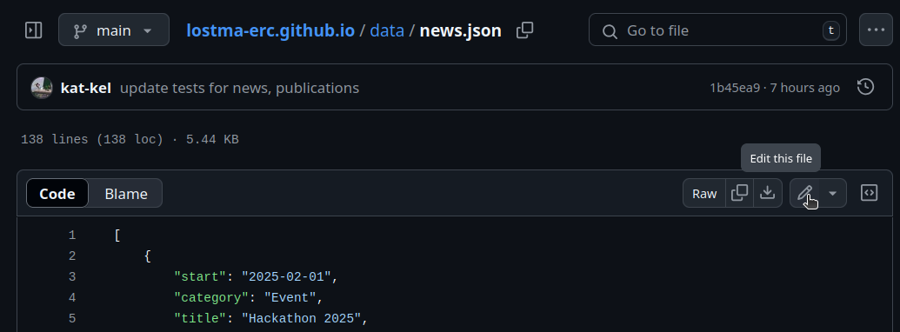
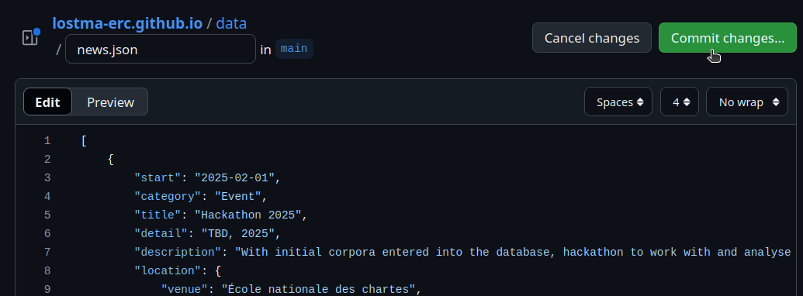
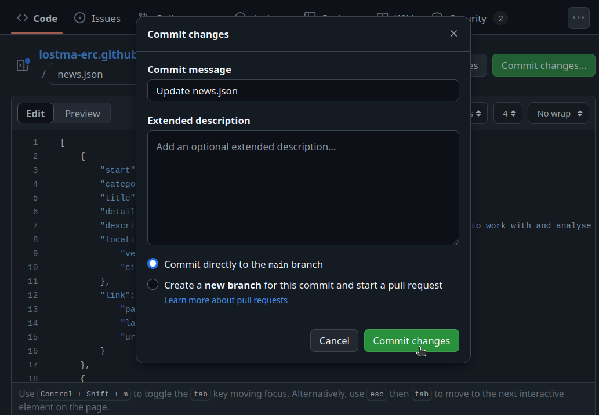
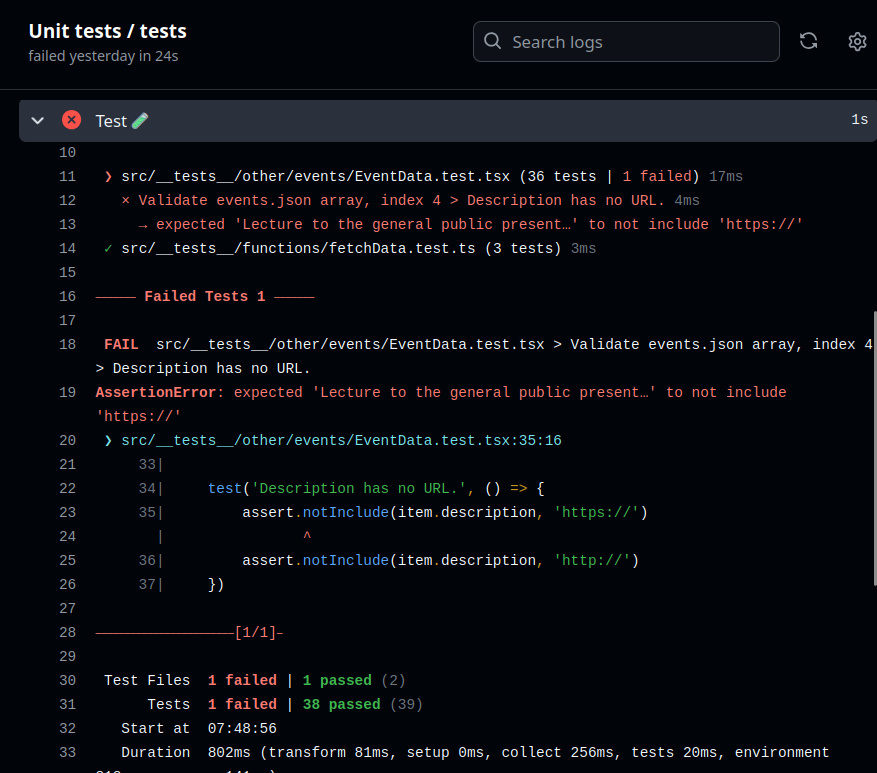

# The Mechanics of Making Changes

You'll be making changes to information about [news](../data/news.json) and [team members / contributors](../data/people.json).

This data is stored in JSON files. Why? JSON is a format that both humans and machines can read. This way, you can read and edit the information like you would a simple text file&mdash;albeit with a special structure. [Learn more about JSON here.](https://www.w3schools.com/whatis/whatis_json.asp)

[Read about the special structure here.](./data.md)

### Where can I find the content?

The JSON files are stored in the [data folder](../data). The website's code parses them and transforms their information into the components seen on the website's pages.

The [`data/people.json`](../data/people.json) file is a JSON dictionary with 2 keys that group the 2 types of contributors: LostMa team members (`"Team"`) and invited collaborators (`"Collaborators"`).

The [`data/news.json`](../data/news.json) file is a JSON array, in which each item is a type of news.

### How can I edit the content?

You can edit the JSON files either directly on GitHub's website or locally on your computer.

#### Option 1: GitHub

To edit a file on GitHub, (a) you'll need to login with your GitHub account and (b) your account needs to be part of the LostMa-ERC group.

Once logged in, navigate to the file you want to edit and click the edit button.

This will reload the page in edit mode. Make the changes you want and then click the "Commit changes..." button.

By default, your changes are set up to be saved to the "main" branch and will have a generic commit message. You can change the message if you want, but do not change from the main branch. Click "Commit changes..." again.

The page will reload into view mode and you will see your changes. However, your changes will not be available on the website unless they pass the formatting tests.

#### Option 2: Local git

You can also edit the JSON files on your local computer and push your commits to the main branch of the GitHub repository.

Once you push your commit, the automated deployment workflow will start to review your formatting. The workflow is triggered by changes to JSON files in the data folder.

Only if your changes pass the unit tests will they be published to the website.

### Validating Your Changes

Once a commit has been made to the any relevant files on the main branch, an automated deployment process will start.

On the top of the screen, click the [Actions](https://github.com/LostMa-ERC/lostma-erc.github.io/actions) tab and watch the workflow start to review your changes to the JSON files.

If the deployment passes without fail, the round indicator to the left will turn green and you will immediately be able to see your changes live on the website at [https://lostma-erc.github.io/](https://lostma-erc.github.io/).

If the deployment fails, click on the workflow to open the details and see why.

An example of a failed workflow is shown in the screenshot below.

Read the log:

- line 16: We see that 1 test failed.
- line 18: We see that the failed test was supposed to verify that a news item's description does not contain a URL. (`> Description has no URL.`) The log also tells us that the problematic news item has index 4 in our file's JSON array. ([What is an array?](https://www.w3resource.com/JSON/snippets/json-array-syntax.php#google_vignette))
- line 19: We can read part of the problematic description. We need to delete the "https://" link from the description (and move it to the `"link"` key).

If your changes did not pass the formatting tests, fix the errors and make a new commit, following the steps already described above. The automated workflow will be triggered again and you can again watch to see your changes be approved and the website be redeployed with your changes.

---

[Next Page: Data formats](./data.md)